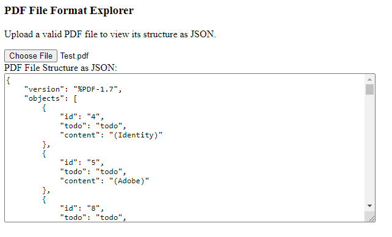

PdfFileFormatExplorer
=====================

The code in this repository, when run, will present a user interface that allows the user to specify a PDF file, and will then display the structure of that PDF file as JSON.

A very simple test document is provided in the Data directory.

